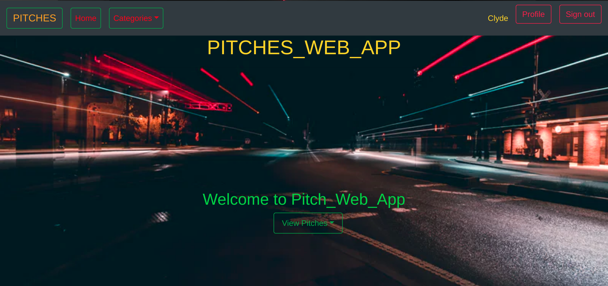

# [Pitch_web_App](https://pyrapitchapp.herokuapp.com/)

This project was generated with [Python](https://www.python.org/) version 3.8.0 <br>



To view the site Click [Pitch_web_app](https://pyrapitchapp.herokuapp.com/)

## Author: 
  * [Peter Mirithu](https://github.com/petermirithu/Pitch_web_App)

#### Authors' information
*Peter Mirithu*
    Email: pyra_m.k@yahoo.com <br>
    Address: 1394 <br>
    Software Developer.<br>
    Telephone N.O: 0790476167          
## Description
  Pitch web app is a project based on giving people a platfrom where they can utilize their 60 seconds to put up a pitch in any category.The app facilitates storage of data permanently giving users a free will to post a pitch and view it at a latter time.
## Setup Requirements
  Here's a brief intro about what a developer must do in order to start running the app locally:

  ```
  $ git clone https://github.com/petermirithu/Pitch_web_App.git
  $ cd Pitch_web_app/
  ```
  * create a virtual environment
  * Activate the virtual environment
  * create your own database
  * add configurations in config.py
  
  ```
  $ pip install -r requerements.txt
  $ chmod a+x start.sh
  $ ./start.sh
  ```
  <hr>
  To run tests:

  ```
  $ python3.6 manage.py test
  ```

## Technologies Used
  This project was generated with
  * [Python](https://www.python.org/) version 3.8.0. 
  * [Flask](https://www.fullstackpython.com/flask.html).
  * Flask Bootstrap.
  * Flask-script.
  * PSQL database.
  * SQLAlembic.

 ## Support and contact details
 Incase of a problem, issue or need more clarification, feel free to send an email<br> @ pyra_m.k@yahoo.com<br>
 Contact Pyra at : 0790476167

 ### License
* This project is licensed by [MIT License](LICENSE.txt)<br>
  Copyright (c) [Peter Mirithu](https://github.com/petermirithu/Pitch_web_App) 2019<br>
  
  


